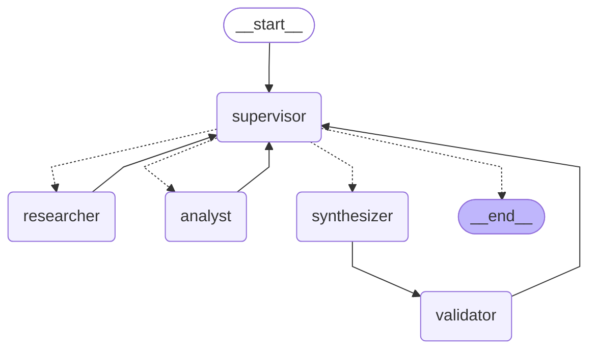

# Orquestador multi-agente con Supervisor (LangGraph)

Pre-entrega 6 del curso AI Architect. Prototipo de un orquestador jerárquico de análisis e investigación: un **Supervisor** recibe la consulta, delega en un **Investigador** (búsqueda semántica sobre la base vectorial de la Pre-entrega 3) y en un **Analista** (cómputo con herramientas), manda a redactar la respuesta, la hace validar y decide si cierra o si algún especialista tiene que refinar su aporte.

La demo del flujo de delegación, ejecutada contra Gemini, está en [`demo.ipynb`](demo.ipynb).

## El grafo



Generado con `graph.get_graph().draw_mermaid()` (`python main.py --diagram` lo regenera en `docs/graph.mmd` y `docs/graph.png`). Las flechas punteadas son la arista condicional del Supervisor: la función `route_from_supervisor` devuelve un `Literal["researcher", "analyst", "synthesizer", "__end__"]` y LangGraph arma los destinos a partir de ese tipo.

| Nodo | Qué hace |
|---|---|
| `supervisor` | Router y controlador de flujo. Evalúa el último aporte contra una rúbrica, elige el próximo paso y redacta la instrucción para ese agente. Unas reglas en código le ponen límites que no puede saltearse. |
| `researcher` | Agente ReAct. Busca en ChromaDB y devuelve hallazgos con cita `[archivo#n]`. |
| `analyst` | Agente ReAct. Calcula y convierte unidades sobre los hallazgos, siempre con herramientas. |
| `synthesizer` | Fase de síntesis final: redacta la respuesta usando solo los aportes. |
| `validator` | Control determinístico (sin LLM): cada número de la respuesta tiene que salir de una herramienta y cada cita tiene que ser un fragmento realmente recuperado. |

## Por qué una topología jerárquica

Con un supervisor en el centro, el control del flujo queda en un solo lugar. Ahí se decide el ruteo, se corta el grafo y se valida antes del `END`. Los especialistas no se conocen entre sí: sumar uno nuevo es agregar un nodo, un valor al `Literal` y una línea en el prompt del supervisor.

Alternativas que descarté:

- **Pipeline fijo** (investigar → analizar → sintetizar). Es más barato, pero no puede saltear pasos ni devolver un aporte para corregirlo. En la consulta de la demo 2 (un dato que no está en la documentación) habría gastado una llamada al Analista sin nada para calcular.
- **Red de agentes o *swarm*** (cada agente le pasa el control a otro). Es más flexible, pero es más difícil garantizar que termine y rastrear quién decidió qué. Con dos especialistas no se justifica.

El costo de esta topología es que cada salto pasa por el supervisor: suma una llamada al LLM por decisión. En la demo se ve cuántas llamadas y tokens gastó cada consulta.

## Flujo de una consulta

1. `START → supervisor`. Sin aportes todavía, el supervisor manda al `researcher` con una instrucción concreta (qué datos buscar).
2. El Investigador hace una o más búsquedas en ChromaDB y devuelve `Hallazgos` (cada uno con su cita) y `No encontrado`. Vuelve al supervisor.
3. El supervisor evalúa la investigación con la rúbrica. Si falta algo, se la devuelve al Investigador diciéndole qué falta. Si alcanza y la consulta pide cálculos, manda al `analyst` una instrucción autocontenida.
4. El Analista calcula con `calculate` / `convert_units` y declara los datos que le faltan. Vuelve al supervisor.
5. Con investigación y análisis suficientes, el supervisor manda al `synthesizer`. La salida pasa sí o sí por el `validator` (arista fija).
6. Con el reporte del validador, el supervisor cierra (`FINISH → END`) o pide una corrección.

## Estado compartido (`state.py`)

`OrchestratorState` hereda de `MessagesState` y agrega campos para rastrear quién aportó qué:

| Campo | Tipo | Lo escribe | Para qué |
|---|---|---|---|
| `messages` | `list[AnyMessage]` (reducer `add_messages`) | usuario y especialistas | La consulta y cada aporte como `AIMessage(name=agente)`. |
| `contributions` | `list[Contribution]` (reducer `operator.add`) | `researcher`, `analyst`, `synthesizer` | Registro append-only: agente, n.º de intento, instrucción recibida, contenido, fuentes, llamadas a herramientas con su salida y estado. |
| `decisions` | `list[Decision]` (reducer `operator.add`) | `supervisor` | Cada decisión con su evaluación, motivo, instrucción y, si hubo, la regla dura que la corrigió. |
| `next_agent` | `Literal[...] \| None` | `supervisor` | Lo lee la arista condicional. |
| `current_instruction` | `str` | `supervisor` | La tarea puntual del próximo agente. |
| `step` | `int` | `supervisor` | Contador de decisiones (condición de parada). |
| `task_completed` | `bool` | `supervisor` | `True` al cerrar. |
| `final_answer` | `str` | `synthesizer` | El borrador vigente. El supervisor solo le agrega una nota si cierra con la validación fallida. |
| `validation` | `ValidationReport \| None` | `validator` | Números sin respaldo, citas inválidas, advertencias. |

Cuántas veces trabajó cada agente no se guarda en un contador aparte: se calcula del historial de `contributions`, así no puede desincronizarse.

## Agentes y herramientas

| Agente | Herramientas (acotadas) | Qué recibe | Qué devuelve |
|---|---|---|---|
| Investigador (`agents/research_agent.py`) | `search_docs(query)`: búsqueda semántica (top 4, coseno) en ChromaDB. `list_sources()`: documentos disponibles. Solo lectura. | Consulta original + instrucción del supervisor (+ su aporte anterior si es un refinamiento). | Hallazgos con cita `[archivo#n]` y lo no encontrado. Los ids de los fragmentos recuperados quedan en `sources`. |
| Analista (`agents/analyst_agent.py`) | `calculate(expression)`: aritmética segura recorriendo el AST (sin `eval`). `convert_units(quantity, target_unit)`: cantidades de Kubernetes (`500m`, `512Mi`, `Gi`...). | Instrucción del supervisor + hallazgos del Investigador. **No** ve la consulta ni los fragmentos crudos. | Cálculos con su operación, conclusiones y datos faltantes. |
| Sintetizador (`agents/synthesizer.py`) | Ninguna. | Consulta + instrucción + hallazgos + resultados (+ el rechazo del validador si es una corrección). | La respuesta final con fuentes. |

Los dos especialistas se crean con `create_agent` de `langchain.agents`, que en LangGraph v1 reemplaza a `create_react_agent` (en esta versión figura como deprecado) y arma el mismo loop ReAct sobre LangGraph.

**Un modelo por rol.** El supervisor y el sintetizador usan el modelo más capaz (`SUPERVISOR_MODEL`, por defecto `gemini-3-flash-preview`), porque evalúan con la rúbrica, deciden y redactan. Los especialistas tienen tareas acotadas y herramientas, así que alcanza con uno liviano (`LLM_MODEL`, por defecto `gemini-3.5-flash-lite`). En la capa gratuita de Gemini cada modelo tiene su propia cuota, así que repartir los roles también reparte el consumo. Un limitador de ritmo por modelo (`InMemoryRateLimiter`, `LLM_RPM=5`) evita chocar con el límite de 5 pedidos por minuto.

La base vectorial (`knowledge_base.py`) es la de la **Pre-entrega 3** ([rag-local](https://github.com/Mati2108/rag-local)): el mismo corpus Orbital, una plataforma interna *ficticia* de despliegue de microservicios, en ChromaDB con similitud coseno. Que sea ficticia es a propósito: el modelo no puede responder de memoria, así que todo dato correcto sale de la base. Acá se trocea por secciones Markdown (19 fragmentos). La colección guarda en su metadata el modelo de embeddings y un hash del corpus, y si alguno cambia se reindexa sola.

## Supervisión: rúbrica, refinamiento y condición de parada

El prompt del supervisor (`agents/supervisor.py`) incluye una rúbrica explícita:

- **Investigación suficiente**: R1, trae cada dato que la consulta necesita, con cita. R2, declara lo que no encontró en vez de completarlo.
- **Análisis suficiente**: A1, cada número derivado salió de una herramienta. A2, usa solo datos investigados. A3, resuelve todos los cálculos pedidos.
- **Respuesta aceptable**: F1, la validación automática pasó. F2, responde cada parte o explica qué no se pudo.

Un aporte que no cumple vuelve al **mismo** agente con una instrucción que dice qué falta. Se devuelve solo por datos faltantes o errores, nunca por estilo.

Para evitar el "supervisor infinito", además del criterio de suficiencia hay reglas duras en código que el LLM no puede pasar por alto (`apply_guards`):

| Regla | Valor por defecto | Qué pasa |
|---|---|---|
| Intentos por agente | 2 (uno + un refinamiento) | Si el LLM elige un agente sin intentos, se sigue con la síntesis o se cierra. |
| Decisiones del supervisor | 8 | Al pasarse, ni se consulta al LLM: se sintetiza con lo disponible y se cierra. |
| No cerrar sin respuesta | — | `FINISH` sin borrador se convierte en `synthesizer`. |
| No cerrar con validación fallida | mientras queden intentos | `FINISH` con la validación rechazada se convierte en una corrección del sintetizador. |
| Pasos internos de cada agente ReAct | 12 | Corta un loop de herramientas descontrolado. El error queda registrado como aporte fallido. |
| `recursion_limit` del grafo | 40 | Última red de seguridad de LangGraph. |

Por qué termina siempre: cada llamada a un especialista consume un intento y los intentos son finitos (3 agentes × 2). El grafo cierra en, como mucho, 7 decisiones del supervisor aunque el LLM insista. El notebook lo muestra con un supervisor guionado que pide investigar para siempre.

## Manejo de conflictos entre agentes

1. **Escritura.** Cada campo del estado tiene un solo dueño, y los aportes y decisiones son append-only (`operator.add`). Ningún agente puede pisar lo que escribió otro, y un refinamiento no borra el intento anterior: queda como intento 2.
2. **Contenido.** Si el Analista usa un número distinto del documento, o dos intentos se contradicen, rige una jerarquía de evidencia:
   - Un dato documental vale si está en un fragmento recuperado. Un número derivado vale si lo produjo una herramienta. Lo que un agente *dice* en su texto no cuenta como evidencia.
   - Entre dos intentos del mismo agente vale el más reciente, porque el supervisor lo pidió como corrección. El sintetizador tiene esa regla en su prompt.
   - El validador detecta números sin respaldo y citas a fragmentos que nunca se recuperaron, y el supervisor pide la corrección.
3. **Control.** Si el LLM del supervisor quiere algo que las reglas no permiten, ganan las reglas. La decisión queda registrada con el motivo en el campo `guard` y se ve en la traza como `⛔ regla dura`.
4. **Conflicto sin resolver.** Si se agotan los intentos y la validación sigue fallando, la respuesta sale igual con una **nota de validación** que dice qué no se pudo verificar.
5. **Fallas.** Si un especialista tira una excepción, el aporte queda con `status="error"` y el supervisor decide con eso. Si falla el LLM del supervisor, se aplica una política por defecto: investigar, sintetizar, cerrar.

## Contaminación de contexto

No todos los agentes ven todo el historial:

| Agente | Ve | No ve |
|---|---|---|
| Supervisor | Consulta, cada aporte recortado a 1.800 caracteres, fuentes, presupuesto y validación. | Los mensajes internos de los agentes ni la salida cruda de las herramientas. |
| Investigador | Consulta e instrucción. | Análisis, evaluaciones del supervisor, metadata del sistema. |
| Analista | Instrucción y hallazgos. | La consulta, los fragmentos crudos de ChromaDB, las evaluaciones del supervisor. |
| Sintetizador | Consulta, instrucción, hallazgos y resultados. | Las llamadas a herramientas y el razonamiento del supervisor. |

El historial interno de cada agente ReAct queda encapsulado en el nodo: al estado global solo vuelven el texto final y el registro de herramientas. Hay un test (`test_el_analista_recibe_solo_instruccion_y_hallazgos`) que verifica que el Analista no recibe ni la consulta, ni los fragmentos crudos, ni las evaluaciones del supervisor.

## Resultados de la corrida real

Salida de [`demo.ipynb`](demo.ipynb), ejecutado el 24/09/2026. Supervisor y sintetizador en `gemini-3-flash-preview`, especialistas en `gemini-3.5-flash-lite`, `thinking_level=low`. Llamadas y tokens son los que reportó la API. Los tiempos incluyen las esperas del limitador de ritmo.

| Consulta | Ruta del supervisor | Validación | Llamadas al LLM | Tokens (entrada / salida) | Tiempo |
|---|---|---|---|---|---|
| Recursos de `pagos-api` al máximo de réplicas, en blue-green y contra el límite por pod | researcher → analyst → synthesizer → FINISH | aprobada: 16 números con respaldo, 3 citas válidas | 10 | 11.728 / 1.691 | 288 s |
| Precio de la licencia para 80 personas (no está en la documentación) | researcher → synthesizer → FINISH | aprobada | 9 | 11.857 / 1.400 | 225 s |

En la primera consulta, el Investigador hizo 2 búsquedas y trajo el manifiesto (`cpu: "500m"`, `memory: "512Mi"`, `replicas.max: 10`), la regla de blue-green (duplica el consumo) y el límite por pod (4 CPU y 8 GiB), cada dato con su cita. El Analista hizo 4 cálculos y 1 conversión con herramientas. La respuesta final:

> Para 10 réplicas del servicio pagos-api, el total reservado es de 5 cores de CPU y 5120 Mi de memoria. Durante una transición blue-green, este consumo se duplica alcanzando los 10 cores y 10240 Mi, mientras que cada pod individual se mantiene dentro de los límites permitidos por la plataforma.

En la segunda, el Investigador hizo 3 búsquedas, declaró el precio como *no encontrado* y el supervisor **se salteó al Analista**. No había nada que calcular, así que la respuesta dice que el dato no está en vez de inventarlo.

El notebook agrega dos corridas determinísticas (sin API): un refinamiento del Investigador más un número inventado que el validador rechaza, y un supervisor que pide investigar para siempre y las reglas duras cortan en 4 decisiones.

La primera versión de la demo usaba un solo modelo sin limitador y chocó a mitad del flujo con el límite de 5 pedidos por minuto. Aun así el grafo terminó: el supervisor cayó a su política por defecto y las reglas de intentos cerraron la ejecución. De esa corrida salieron el limitador de ritmo, el reparto de modelos por rol y un arreglo: si el sintetizador falla, el mensaje de error ya no queda como respuesta.

## Cómo correrlo

Requisitos: Python 3.10 o superior y una clave de Gemini (tiene [capa gratuita](https://aistudio.google.com/apikey)).

```bash
git clone https://github.com/Mati2108/orquestador-multiagente.git
cd orquestador-multiagente
python3 -m venv .venv
source .venv/bin/activate          # Windows: .venv\Scripts\activate
pip install -r requirements.txt
cp .env.example .env               # completá GOOGLE_API_KEY
```

```bash
python knowledge_base.py           # indexa knowledge/ en ChromaDB (si no, se hace solo la primera vez)
python main.py --demo              # consulta de demostración con la traza de delegación
python main.py "¿Qué pasa si despliego a prod un viernes sin --hotfix?"
python main.py --diagram           # regenera docs/graph.mmd y docs/graph.png
pytest                             # 32 tests offline: no usan la API
jupyter nbconvert --to notebook --execute demo.ipynb --inplace   # re-ejecuta la demo
```

Los tests usan dobles guionados (`tests/doubles.py`) en lugar del LLM y cubren el flujo completo, el refinamiento, las reglas duras, el límite de pasos, la validación, el aislamiento de contexto, las herramientas y la base vectorial.

## Estructura

```
orquestador-multiagente/
├── state.py                  # OrchestratorState (MessagesState + trazabilidad) y helpers
├── graph.py                  # StateGraph: nodos, arista condicional del supervisor, compile
├── main.py                   # CLI, traza legible y medición de llamadas/tokens
├── config.py                 # settings desde .env, modelos por rol, limitador de ritmo, embeddings
├── knowledge_base.py         # ChromaDB: chunking por secciones, reindexado automático
├── agents/
│   ├── supervisor.py         # prompt con rúbrica, salida estructurada, reglas duras, arista condicional
│   ├── research_agent.py     # Investigador: search_docs, list_sources
│   ├── analyst_agent.py      # Analista: calculate, convert_units
│   ├── synthesizer.py        # síntesis final
│   ├── validator.py          # validación determinística del borrador
│   └── common.py             # correr un agente ReAct y registrar su aporte
├── knowledge/                # corpus Orbital (de la Pre-entrega 3)
├── docs/graph.mmd, graph.png # diagrama del grafo
├── demo.ipynb                # demo ejecutada del flujo de delegación
└── tests/                    # tests offline + dobles guionados
```

## Limitaciones

- **El validador es una heurística.** Verifica que cada número se pueda rastrear hasta una herramienta, pero no entiende qué significa: un número chico que aparece en cualquier fragmento recuperado (un 2, un 10) pasa aunque se haya usado mal. La revisión semántica la hace el supervisor con su rúbrica.
- **Cuota de la capa gratuita de Gemini.** En esta cuenta, cada modelo admite 5 pedidos por minuto y 20 por día. El limitador de ritmo cubre el primer límite, pero hace más lenta cada consulta. Para el segundo, si un modelo se agota se lo puede cambiar por otro en `SUPERVISOR_MODEL` o `LLM_MODEL`. Con una clave paga conviene `LLM_RPM=0`.
- **Ejecución secuencial.** Los especialistas no corren en paralelo. Para estas consultas no hace falta: el Analista necesita los datos del Investigador.
- **Salidas no determinísticas.** Con un LLM real, la cantidad de pasos y el texto cambian entre corridas. Lo determinístico (ruteo forzado, reglas y validación) está cubierto por los tests.
