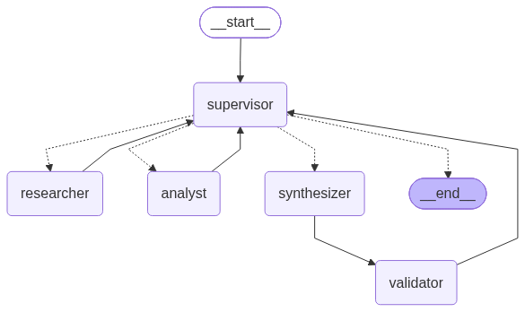

# Orquestador multi-agente con Supervisor (LangGraph)

Pre-entrega 6 del curso AI Architect. Prototipo de un orquestador jerárquico de análisis e investigación: un **Supervisor** recibe la consulta, delega en un **Investigador** (búsqueda semántica sobre la base vectorial de la Pre-entrega 3) y en un **Analista** (cómputo con herramientas), manda a redactar la respuesta, la hace validar y decide si cierra o si algún especialista tiene que refinar su aporte.

La demo del flujo de delegación, ejecutada contra Gemini, está en [`demo.ipynb`](demo.ipynb). Los casos de refinamiento y de corte están en [`demo_reglas.ipynb`](demo_reglas.ipynb), que corre sin clave de API.

## El grafo


La misma imagen, renderizada con `graph.get_graph().draw_mermaid_png()`:



El bloque Mermaid sale de `graph.get_graph().draw_mermaid()` (`python main.py --diagram` regenera `docs/graph.mmd` y `docs/graph.png`). Las flechas punteadas son la arista condicional del Supervisor: la función `route_from_supervisor` devuelve un `Literal["researcher", "analyst", "synthesizer", "__end__"]` y LangGraph arma los destinos a partir de ese tipo.

| Nodo | Qué hace |
|---|---|
| `supervisor` | Router y controlador de flujo. Evalúa el último aporte contra una rúbrica, elige el próximo paso y redacta la instrucción para ese agente. Unas reglas en código le ponen límites que no puede saltearse. |
| `researcher` | Agente ReAct. Busca en ChromaDB y devuelve hallazgos con cita `[archivo#n]`. |
| `analyst` | Agente ReAct. Calcula y convierte unidades sobre los hallazgos, siempre con herramientas. |
| `synthesizer` | Fase de síntesis final: redacta la respuesta usando solo los aportes. |
| `validator` | Control determinístico (sin LLM): cada número de la respuesta tiene que salir de una herramienta (o de la consulta del usuario), y cada cita tiene que apuntar a un fragmento, o a un archivo, realmente recuperado. |

## Por qué una topología jerárquica

Con un supervisor en el centro, el control del flujo queda en un solo lugar. Ahí se decide el ruteo, se corta el grafo y se valida antes del `END`. Los especialistas no se conocen entre sí. Sumar uno nuevo es agregar su nodo y su arista de vuelta en `graph.py`, su nombre en los `Literal` de `state.py` y de la arista condicional, y su descripción en el prompt del supervisor. Ningún otro agente cambia.

Alternativas que descarté:

- **Pipeline fijo** (investigar → analizar → sintetizar). Es más barato, pero no puede saltear pasos ni devolver un aporte para corregirlo. En la consulta de la demo 2 (un dato que no está en la documentación) habría gastado una llamada al Analista sin nada para calcular.
- **Red de agentes o *swarm*** (cada agente le pasa el control a otro). Es más flexible, pero es más difícil garantizar que termine y rastrear quién decidió qué. Con dos especialistas no se justifica.

El costo de esta topología es que cada salto pasa por el supervisor: suma una llamada al LLM por decisión. En la demo se ve cuántas llamadas y tokens gastó cada consulta.

## Flujo de una consulta

1. `START → supervisor`. Sin aportes todavía, el supervisor manda al `researcher` con una instrucción concreta (qué datos buscar).
2. El Investigador hace una o más búsquedas en ChromaDB y devuelve `Hallazgos` (cada uno con su cita) y `No encontrado`. Vuelve al supervisor.
3. El supervisor evalúa la investigación con la rúbrica. Si falta algo, se la devuelve al Investigador diciéndole qué falta. Si alcanza y la consulta pide cálculos, manda al `analyst` una instrucción autocontenida.
4. El Analista calcula con `calculate` / `convert_units` y declara los datos que le faltan. Vuelve al supervisor.
5. Con investigación y análisis suficientes, el supervisor manda al `synthesizer`. La salida pasa sí o sí por el `validator` (arista fija).
6. Con el reporte del validador, el supervisor cierra (`FINISH → END`) o pide una corrección.

## Estado compartido (`state.py`)

`OrchestratorState` hereda de `MessagesState` y agrega campos para rastrear quién aportó qué:

| Campo | Tipo | Lo escribe | Para qué |
|---|---|---|---|
| `messages` | `list[AnyMessage]` (reducer `add_messages`) | usuario y especialistas | La consulta y cada aporte como `AIMessage(name=agente)`. |
| `contributions` | `list[Contribution]` (reducer `operator.add`) | `researcher`, `analyst`, `synthesizer` | Registro append-only: agente, n.º de intento, instrucción recibida, contenido, fuentes, llamadas a herramientas con su salida, evidencia verificable y estado. |
| `decisions` | `list[Decision]` (reducer `operator.add`) | `supervisor` | Cada decisión con su evaluación, motivo, instrucción y, si hubo, la regla dura que la corrigió. |
| `next_agent` | `Literal[...] \| None` | `supervisor` | Lo lee la arista condicional. |
| `current_instruction` | `str` | `supervisor` | La tarea puntual del próximo agente. |
| `step` | `int` | `supervisor` | Contador de decisiones (condición de parada). |
| `task_completed` | `bool` | `supervisor` | `True` al cerrar. |
| `final_answer` | `str` | `synthesizer` | El borrador vigente. El supervisor solo le agrega una nota si cierra con la validación fallida o con aportes que el borrador no incorpora. |
| `validation` | `ValidationReport \| None` | `validator` | Números sin respaldo, citas inválidas, advertencias. |

Cuántas veces trabajó cada agente no se guarda en un contador aparte: se calcula del historial de `contributions`, así no puede desincronizarse.

Los agentes no se llaman entre sí: se comunican de forma asíncrona a través del estado. Cada uno lee lo que necesita y deja su aporte registrado, así nada se pierde entre turnos. El grafo corre igual con `invoke`/`stream` que con `ainvoke`/`astream`, y hay un test que lo verifica.

## Agentes y herramientas

| Agente | Herramientas (acotadas) | Qué recibe | Qué devuelve |
|---|---|---|---|
| Investigador (`agents/research_agent.py`) | `search_docs(query)`: búsqueda semántica (top 4, coseno) en ChromaDB. `list_sources()`: documentos disponibles. Solo lectura. | Consulta original + instrucción del supervisor (+ su aporte anterior si es un refinamiento). | Hallazgos con cita `[archivo#n]` y lo no encontrado. Los ids de los fragmentos recuperados quedan en `sources`. |
| Analista (`agents/analyst_agent.py`) | `calculate(expression)`: aritmética segura recorriendo el AST (sin `eval`). `convert_units(quantity, target_unit)`: cantidades de Kubernetes (`500m`, `512Mi`, `Gi`...). | Instrucción del supervisor + hallazgos del Investigador. **No** ve la consulta ni los fragmentos crudos. | Cálculos con su operación, conclusiones y datos faltantes. |
| Sintetizador (`agents/synthesizer.py`) | Ninguna. | Consulta + instrucción + hallazgos + resultados (+ el rechazo del validador si es una corrección). | La respuesta final con fuentes. |

Los dos especialistas se crean con `create_agent` de `langchain.agents`, que arma el mismo loop ReAct sobre LangGraph. Es el reemplazo oficial de `create_react_agent`: con LangGraph 1.2, llamar a `create_react_agent` avisa *"create_react_agent has been moved to `langchain.agents`. Please update your import to `from langchain.agents import create_agent`. Deprecated in LangGraph V1.0 to be removed in V2.0."*

**Un modelo por rol.** El supervisor y el sintetizador usan el modelo más capaz (`SUPERVISOR_MODEL`, por defecto `gemini-3-flash-preview`), porque evalúan con la rúbrica, deciden y redactan. Los especialistas tienen tareas acotadas y herramientas, así que alcanza con uno liviano (`LLM_MODEL`, por defecto `gemini-3.5-flash-lite`). En la capa gratuita de Gemini cada modelo tiene su propia cuota, así que repartir los roles también reparte el consumo. Un limitador de ritmo por modelo (`InMemoryRateLimiter`, `LLM_RPM=5`) evita chocar con el límite de 5 pedidos por minuto.

La base vectorial (`knowledge_base.py`) es la de la **Pre-entrega 3** ([rag-local](https://github.com/Mati2108/rag-local)): el mismo corpus Orbital, una plataforma interna *ficticia* de despliegue de microservicios, en ChromaDB con similitud coseno. Que sea ficticia es a propósito: el modelo no puede responder de memoria, así que todo dato correcto sale de la base. Acá se trocea por secciones Markdown (19 fragmentos). La colección guarda en su metadata el modelo de embeddings y un hash del corpus, y si alguno cambia se reindexa sola.

## Supervisión: rúbrica, refinamiento y condición de parada

En cada turno, el supervisor recibe la consulta, los aportes registrados y el presupuesto que queda, y responde a *"Dada la conversación actual, ¿quién debe intervenir ahora o es momento de finalizar?"*. Su salida estructurada (`SupervisorDecision.next`) es un `Literal` con los nombres de los nodos, más `FINISH`, que la arista condicional traduce a `END`. El prompt (`agents/supervisor.py`) incluye una rúbrica explícita:

- **Investigación suficiente**: R1, trae cada dato que la consulta necesita, con cita. R2, declara lo que no encontró en vez de completarlo.
- **Análisis suficiente**: A1, cada número derivado salió de una herramienta. A2, usa solo datos investigados. A3, resuelve todos los cálculos pedidos.
- **Respuesta aceptable**: F1, la validación automática pasó. F2, responde cada parte o explica qué no se pudo.

Un aporte que no cumple vuelve al **mismo** agente con una instrucción que dice qué falta. Se devuelve solo por datos faltantes o errores, nunca por estilo.

Para evitar el "supervisor infinito", además del criterio de suficiencia hay reglas duras en código que el LLM no puede pasar por alto (`apply_guards`):

| Regla | Valor por defecto | Qué pasa |
|---|---|---|
| Intentos por agente | 2 (uno + un refinamiento) | Si el LLM elige un agente sin intentos, se sigue con la síntesis o se cierra. |
| Decisiones del supervisor | 8 | Al pasarse, ni se consulta al LLM: se sintetiza con lo disponible y se cierra. |
| No responder sin investigar | — | `FINISH` sin borrador y sin ninguna investigación se convierte en `researcher`. Si ya se investigó, en `synthesizer`. |
| Borrador desactualizado | mientras queden intentos | Si después del último borrador llegaron aportes nuevos, `FINISH` se convierte en `synthesizer` para incorporarlos. |
| No cerrar con validación fallida | mientras queden intentos | `FINISH` con la validación rechazada se convierte en una corrección del sintetizador. |
| Pasos internos de cada agente ReAct | 12 | Corta un loop de herramientas descontrolado. El error queda registrado como aporte fallido. |
| `recursion_limit` del grafo | 40 | Última red de seguridad de LangGraph. |

Por qué termina siempre: cada llamada a un especialista consume un intento y los intentos son finitos (3 agentes × 2). El grafo cierra en, como mucho, 7 decisiones del supervisor aunque el LLM insista. [`demo_reglas.ipynb`](demo_reglas.ipynb) lo muestra con un supervisor guionado que pide investigar para siempre. `MAX_STEPS=8` queda como segunda red por si se suben los intentos por agente.

## Manejo de conflictos entre agentes

1. **Escritura.** Los campos que escriben varios nodos (`messages`, `contributions`) son append-only con reducer, y los de reemplazo tienen un único escritor. La única excepción es que el supervisor agrega notas a `final_answer` al cerrar. Ningún agente puede pisar lo que escribió otro, y un refinamiento no borra el intento anterior: queda como intento 2.
2. **Contenido.** Si el Analista usa un número distinto del documento, o dos intentos se contradicen, rige una jerarquía de evidencia:
   - Un dato documental vale si está en el texto de un fragmento recuperado. Un número derivado vale si lo produjo una herramienta. Lo que un agente *dice* en su texto no cuenta como evidencia, y tampoco la metadata de las herramientas (ids de fragmentos, puntajes).
   - Entre dos intentos del mismo agente vale el más reciente, porque el supervisor lo pidió como corrección. El Analista y el sintetizador, que son los que reciben varios intentos, tienen esa regla en su prompt.
   - El validador detecta números sin respaldo y citas a fragmentos o archivos que nunca se recuperaron, y el supervisor pide la corrección.
3. **Control.** Si el LLM del supervisor quiere algo que las reglas no permiten, ganan las reglas. La decisión queda registrada con el motivo en el campo `guard` y se ve en la traza como `⛔ regla dura`.
4. **Conflicto sin resolver.** Si se agotan los intentos y la validación sigue fallando, la respuesta sale igual con una **nota de validación** que dice qué no se pudo verificar.
5. **Fallas.** Si un especialista tira una excepción, el aporte queda con `status="error"` y el supervisor decide con eso. Si falla el LLM del supervisor, se aplica una política por defecto: investigar, sintetizar, cerrar.

## Contaminación de contexto

No todos los agentes ven todo el historial:

| Agente | Ve | No ve |
|---|---|---|
| Supervisor | Consulta, cada aporte recortado a 1.800 caracteres, fuentes, presupuesto y validación. | Los mensajes internos de los agentes ni la salida cruda de las herramientas. |
| Investigador | Consulta e instrucción. | Análisis, evaluaciones del supervisor, metadata del sistema. |
| Analista | Instrucción y hallazgos. | La consulta, los fragmentos crudos de ChromaDB, las evaluaciones del supervisor. |
| Sintetizador | Consulta, instrucción, hallazgos y resultados. | Las llamadas a herramientas y el razonamiento del supervisor. |

El historial interno de cada agente ReAct queda encapsulado en el nodo: al estado global solo vuelven el texto final y el registro de herramientas. Hay un test (`test_el_analista_recibe_solo_instruccion_y_hallazgos`) que verifica que el Analista no recibe ni la consulta, ni los fragmentos crudos, ni las evaluaciones del supervisor.

## Resultados de la corrida real

Corridas del 24/09/2026: las dos primeras filas salen de [`demo.ipynb`](demo.ipynb) y la tercera de `python main.py`. Las dos primeras se ejecutaron antes de corregir el validador (ver la nota al final de esta sección). Supervisor y sintetizador en `gemini-3-flash-preview`, especialistas en `gemini-3.5-flash-lite`, `thinking_level=low`. Llamadas y tokens son los que reportó la API. Los tiempos incluyen las esperas del limitador de ritmo.

| Consulta | Ruta del supervisor | Validación | Llamadas al LLM | Tokens (entrada / salida) | Tiempo |
|---|---|---|---|---|---|
| Recursos de `pagos-api` al máximo de réplicas, en blue-green y contra el límite por pod | researcher → analyst → synthesizer → FINISH | aprobada: 16 números con respaldo, 3 citas válidas | 10 | 11.728 / 1.691 | 288 s |
| Precio de la licencia para 80 personas (no está en la documentación) | researcher → synthesizer → FINISH | aprobada | 9 | 11.857 / 1.400 | 225 s |
| ¿Qué pasa si despliego a prod un viernes sin `--hotfix`? (`python main.py`, [traza completa](docs/corrida_refinamiento.txt)) | researcher → **researcher** → synthesizer → FINISH | aprobada: 4 números con respaldo, 1 cita válida | 10 | 9.646 / 1.825 | 286 s |

En la primera consulta, el Investigador hizo 2 búsquedas y trajo el manifiesto (`cpu: "500m"`, `memory: "512Mi"`, `replicas.max: 10`), la regla de blue-green (duplica el consumo) y el límite por pod (4 CPU y 8 GiB), cada dato con su cita. El Analista hizo 4 cálculos y 1 conversión con herramientas. La respuesta final:

> Para 10 réplicas del servicio pagos-api, el total reservado es de 5 cores de CPU y 5120 Mi de memoria. Durante una transición blue-green, este consumo se duplica alcanzando los 10 cores y 10240 Mi, mientras que cada pod individual se mantiene dentro de los límites permitidos por la plataforma.

En la segunda, el Investigador hizo 3 búsquedas, declaró el precio como *no encontrado* y el supervisor **se salteó al Analista**. No había nada que calcular, así que la respuesta dice que el dato no está en vez de inventarlo.

La tercera consulta muestra un **refinamiento real, sin guion**. El supervisor evaluó que la primera investigación traía la ventana horaria pero no qué pasa fuera de ella, y le devolvió la tarea al Investigador con una instrucción más específica. Con el segundo aporte pasó a la síntesis.

[`demo_reglas.ipynb`](demo_reglas.ipynb) agrega tres corridas determinísticas (sin API):
- un refinamiento del Investigador y un número inventado que el validador rechaza;
- un supervisor que pide investigar para siempre y las reglas duras cortan en 4 decisiones;
- un aporte que llega después de un borrador validado y obliga a actualizarlo antes de cerrar.

**Nota sobre el validador.** Una auditoría posterior encontró que el validador tomaba como evidencia la metadata de las herramientas (el `#5` de un id de fragmento respaldaba un "5") y no controlaba las citas a archivo sin `#n`. Lo corregí y re-validé las respuestas grabadas con la versión nueva, reconstruyendo la evidencia a partir de los ids de fragmentos que figuran en cada traza:
- la consulta 1 sigue aprobada, con 14 números con respaldo en lugar de 16, porque ya no cuenta los dígitos de los nombres de archivo;
- la tercera da el mismo resultado;
- la respuesta de la consulta 2 ahora se rechazaría, porque cita dos archivos (`02_...` y `03_...`) de los que no se recuperó ningún fragmento, y el supervisor pediría corregirla.

`demo.ipynb` se vuelve a ejecutar con la próxima cuota diaria de la API.

La primera versión de la demo usaba un solo modelo sin limitador y chocó a mitad del flujo con el límite de 5 pedidos por minuto. Aun así el grafo terminó: el supervisor cayó a su política por defecto y las reglas de intentos cerraron la ejecución. De esa corrida salieron el limitador de ritmo, el reparto de modelos por rol y un arreglo: si el sintetizador falla, el mensaje de error ya no queda como respuesta.

## Cómo correrlo

Requisitos: Python 3.10 o superior y una clave de Gemini (tiene [capa gratuita](https://aistudio.google.com/apikey)).

```bash
git clone https://github.com/Mati2108/orquestador-multiagente.git
cd orquestador-multiagente
python3 -m venv .venv
source .venv/bin/activate          # Windows: .venv\Scripts\activate
pip install -r requirements.txt
cp .env.example .env               # completá GOOGLE_API_KEY
```

```bash
python knowledge_base.py           # indexa knowledge/ en ChromaDB (si no, se hace solo la primera vez)
python main.py --demo              # consulta de demostración con la traza de delegación
python main.py "¿Qué pasa si despliego a prod un viernes sin --hotfix?"
python main.py --diagram           # regenera docs/graph.mmd y docs/graph.png (no necesita clave)
pytest                             # 41 tests offline: no usan la API
jupyter nbconvert --to notebook --execute demo_reglas.ipynb --inplace   # escenarios sin API
jupyter nbconvert --to notebook --execute demo.ipynb --inplace          # corridas reales (usa la API)
```

Los tests usan dobles guionados (`tests/doubles.py`) en lugar del LLM. Cubren:
- el flujo completo, el refinamiento y cada regla dura (incluidos cerrar sin investigar y el borrador desactualizado);
- el límite de pasos y la validación, con metadata que no cuenta como evidencia y citas a archivo;
- el aislamiento de contexto y que un error no le llegue como dato al siguiente agente;
- la ejecución async, la CLI sin clave, las herramientas y la base vectorial.

## Estructura

```
orquestador-multiagente/
├── state.py                  # OrchestratorState (MessagesState + trazabilidad) y helpers
├── graph.py                  # StateGraph: nodos, arista condicional del supervisor, compile
├── main.py                   # CLI, traza legible y medición de llamadas/tokens
├── config.py                 # settings desde .env, modelos por rol, limitador de ritmo, embeddings
├── knowledge_base.py         # ChromaDB: chunking por secciones, reindexado automático
├── agents/
│   ├── supervisor.py         # prompt con rúbrica, salida estructurada, reglas duras, arista condicional
│   ├── research_agent.py     # Investigador: search_docs, list_sources
│   ├── analyst_agent.py      # Analista: calculate, convert_units
│   ├── synthesizer.py        # síntesis final
│   ├── validator.py          # validación determinística del borrador
│   └── common.py             # correr un agente ReAct y registrar su aporte
├── knowledge/                # corpus Orbital (de la Pre-entrega 3)
├── docs/                     # diagrama del grafo (.mmd y .png) y traza de la corrida con refinamiento
├── demo.ipynb                # demo del flujo de delegación ejecutada contra Gemini
├── demo_reglas.ipynb         # refinamiento y reglas de parada con dobles guionados (sin API)
└── tests/                    # tests offline + dobles guionados
```

## Limitaciones

- **La búsqueda es solo semántica.** En la tercera consulta, ninguna de las 3 búsquedas trajo entre los 4 fragmentos más parecidos la sección de `04_troubleshooting.md` que nombra el error `PROD_WINDOW_CLOSED`. El sistema no lo inventó: lo declaró como no encontrado, pero la respuesta quedó menos completa de lo que permite la documentación. Una búsqueda híbrida (BM25 + vectores, como la de la Pre-entrega 4) encontraría ese tipo de término exacto.
- **El validador es una heurística.** Verifica que cada número se pueda rastrear hasta una herramienta, pero no entiende qué significa: un número chico que aparece en cualquier fragmento recuperado (un 2, un 10) pasa aunque se haya usado mal. La revisión semántica la hace el supervisor con su rúbrica.
- **Cuota de la capa gratuita de Gemini.** En esta cuenta, cada modelo admite 5 pedidos por minuto y 20 por día. El limitador de ritmo cubre el primer límite, pero hace más lenta cada consulta. Para el segundo, si un modelo se agota se lo puede cambiar por otro en `SUPERVISOR_MODEL` o `LLM_MODEL`. Con una clave paga conviene `LLM_RPM=0`.
- **Ejecución secuencial.** Los especialistas no corren en paralelo. Para estas consultas no hace falta: el Analista necesita los datos del Investigador.
- **Salidas no determinísticas.** Con un LLM real, la cantidad de pasos y el texto cambian entre corridas. Lo determinístico (ruteo forzado, reglas y validación) está cubierto por los tests.
